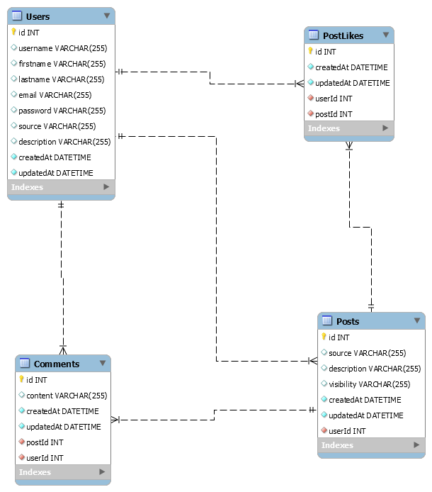

## Install dependencies:
```
cd ui
npm install
```
```
cd api
npm install
```

## Available Scripts
###  Start ui server:
```
cd ui
npm start
```
###  Start api server:
``` 
cd api
npm start
```

### Initialize Database:

```
cd api
node scripts/init.mysql.js
(Run Mysql script in mysql workbench for now)
Check .env file to config mysql server
```


